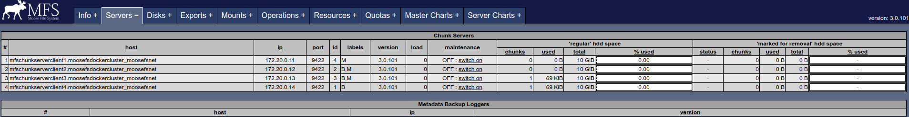

# moosefs-docker-cluster
Multiple node MooseFS cluster on Docker.

Based on [Kai Sasaki's *Lewuathe/docker-hadoop-cluster*](https://github.com/Lewuathe/docker-hadoop-cluster)

Cluster configuration:
- master with CGI [http://172.20.0.2:9425](http://172.20.0.2:9425)
- 5 chunkservers **172.20.0.11-15** with **10 GiB** of storage each



## Setup

Install Docker with composer from [https://docs.docker.com/compose/install/](https://docs.docker.com/compose/install/)

```
# Clone repository
git clone https://github.com/moosefs/moosefs-docker-cluster
cd moosefs-docker-cluster
docker-compose up --build
```

Check if instances are running:

```
docker ps
```
Expected output should be similar to:
```
CONTAINER ID        IMAGE                               COMMAND                  CREATED             STATUS              PORTS                     NAMES
1951d867c078        dockermoosefscluster_chunkserver5   "/home/start-chunk..."   5 minutes ago       Up 5 minutes        9419-9420/tcp, 9422/tcp   chunkserver5
204c115cd8ad        dockermoosefscluster_chunkserver2   "/home/start-chunk..."   5 minutes ago       Up 5 minutes        9419-9420/tcp, 9422/tcp   chunkserver2
48343721de4f        dockermoosefscluster_chunkserver4   "/home/start-chunk..."   5 minutes ago       Up 5 minutes        9419-9420/tcp, 9422/tcp   chunkserver4
30ca217fa862        dockermoosefscluster_master         "/home/start.sh -d"      5 minutes ago       Up 5 minutes        9420-9425/tcp             master
28e2a64d0fb9        dockermoosefscluster_chunkserver1   "/home/start-chunk..."   5 minutes ago       Up 5 minutes        9419-9420/tcp, 9422/tcp   chunkserver1
c83c70580795        dockermoosefscluster_chunkserver3   "/home/start-chunk..."   5 minutes ago       Up 5 minutes        9419-9420/tcp, 9422/tcp   chunkserver3
```

# Change configuration

If you want to change storage size you can modify chunkserver start script [moosefs-chunkserver/start-chunkserver.sh](https://github.com/moosefs/moosefs-docker-cluster/blob/master/moosefs-chunkserver/start-chunkserver.sh)

Containers configuration is stored in [docker-compose.yml](https://github.com/moosefs/moosefs-docker-cluster/blob/master/docker-compose.yml)
```
version: '2'

services:
  master:
    build: ./moosefs-master
    container_name: "master"
    networks:
      mfsnet:
        ipv4_address: "172.20.0.2"
  chunkserver1:
    build: ./moosefs-chunkserver
    container_name: "chunkserver1"
    networks:
      mfsnet:
        ipv4_address: "172.20.0.11"
  chunkserver2:
    build: ./moosefs-chunkserver
    container_name: "chunkserver2"
    networks:
      mfsnet:
        ipv4_address: "172.20.0.12"
  chunkserver3:
    build: ./moosefs-chunkserver
    container_name: "chunkserver3"
    networks:
      mfsnet:
        ipv4_address: "172.20.0.13"
  chunkserver4:
    build: ./moosefs-chunkserver
    container_name: "chunkserver4"
    networks:
      mfsnet:
        ipv4_address: "172.20.0.14"
  chunkserver5:
    build: ./moosefs-chunkserver
    container_name: "chunkserver5"
    networks:
      mfsnet:
        ipv4_address: "172.20.0.15"
networks:
  mfsnet:
    driver: bridge
    ipam:
     config:
       - subnet: 172.20.0.0/16
         gateway: 172.20.0.1

```

# Docker Hub

| Image name | Pulls | Stars | Build |
|:-----|:-----|:-----|:-----|
| [karolmajek/moosefs-master](https://hub.docker.com/r/karolmajek/moosefs-master/) | [](https://hub.docker.com/r/karolmajek/moosefs-master/) |  |  |
| [karolmajek/moosefs-chunkserver](https://hub.docker.com/r/karolmajek/moosefs-chunkserver/)  | [](https://hub.docker.com/r/karolmajek/moosefs-chunkserver/)    |   |  |
